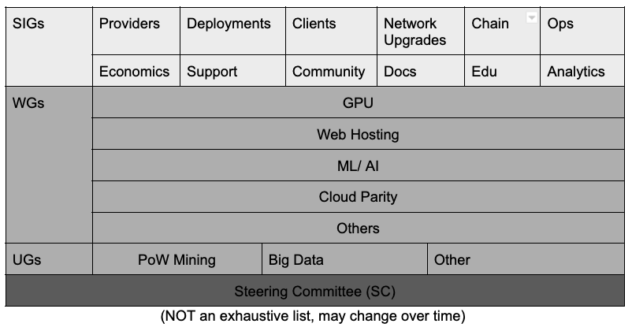

Welcome to the Akash Network community!

This is the starting point for joining and contributing to building Akash Network - committing code, writing docs, testing product features & reporting bugs, organizing meetups, suggesting ideas for new features etc.

## Getting Started

- To learn about the types of community groups read the rest of this document
- To see a full list of current Akash Network community groups, see [community/cg-list](cg-list.md)
- To learn about our product strategy & prioritization framework, see [community/product-strategy](product-strategy.md)
- To see a list of projects being worked on or under consideration see [community/project-list](projects-list.md)

## Community Groups

The Akash Network community groups are insipired by the [Kubernetes project](https://github.com/kubernetes/community) and currently consist of the following groups. As our community evolves, we will consider changing this structure as needed. All groups listed below or open to anyone interested in participating in them, except "Commitees" that have preassigned members.



```goat
|-----------------------------------------------------------------------------------------------------|
|                       | Providers  | Deployments | Clients   | Network Upgrades | Chain | Ops       |  
|   SIGs                | ---------- | ------------|-----------|------------------|-------|-----------|
|                       | Econonmics | Support     | Community |       Docs       | Edu   | Analytics |
|-----------------------------------------------------------------------------------------------------|
|   WGs                 |                                   GPU                                       |
|                       |-----------------------------------------------------------------------------|
|                       |                               Web Hosting                                   |
|                       |-----------------------------------------------------------------------------|
|                       |                                 ML/ AI                                      |
|                       |-----------------------------------------------------------------------------|
|                       |                              Cloud Parity                                   |
|                       |-----------------------------------------------------------------------------|
|                       |                                 Others                                      |
|-----------------------------------------------------------------------------------------------------|
|   UGs                 |                    POW Mining | Big Data | Others                           |
|-----------------------------------------------------------------------------------------------------|
```

### Special Interest Groups (SIGs)

SIGs are vertically specialized community groups that are working on foundational elements of Akash Network on implementing and supporting products that are defined by the working groups or by smaller feature ideas. **SIGs may generally be involved in both defining (spec’ing) as well as building specific products and features. SIGs are persistent groups in that they exist forever.**

### Working Groups (WGs)

WGs are horizontally aligned community groups that are pursuing significantly large cross cutting initiatives, involving multiple SIGs. **WGs do not work on implementing features or projects but will be involved in defining (PRD style) large projects with multiple components across the entire stack** and potentially involving non-Akash partners and stakeholders as well. **Working groups may be active for days, weeks or months but are generally not considered “persistent” like SIGs.**

### User Groups (UGs)

UGs are for facilitating open communication and discovery of topics that may end up in WGs or SIGs. These may also be groups discussing broad use cases like ML/ AI or Big Data. Lastly, these may be things that we don’t prioritize for product development based on our current strategy but still things that people want to discuss.

### Committees

Committees are named sets of people that are chartered to take on sensitive topics. This group is encouraged to be as open as possible while achieving its mission but, because of the nature of the topics discussed, private communications are allowed. Examples of committees include the steering committee and things like security or code of conduct.

- #### Steering Commitee
  
    The Steeting Commitee is a special SIG that periodically evaluates the list of projects, prioritizes/ adds/ removes items from them and decides which SIG or WG is best suited to tackle it. The Steering committee also regularly meets to incorporate learnings to improve how the Akash Network community operates and performs conflict resolution as necessary

### Examples

To see a list of projects being worked on or under consideration see [community/project-list](projects-list.md)

- A “GPU-WG” that works on end to end execution of what it will take for Akash Network to support GPUs. This may include specifications for changes to Deployments (SDL) and Providers, deciding on what vendors and models of GPUs fit with our customer use cases, figure out the best partnerships for sourcing GPU inventory for those models, decide whether we need to solve bandwidth pricing, running alpha/ beta testing etc.  The GPU-WGs work will potentially result in multiple projects being created for the “Providers-SIG”, the “Deployments-SIG”, the “Economics-SIG” and so on, who will define a lower level spec for their specific area (based on the overall high level spec defined by the GPU-SIG), and implement it.
  
- An “Ethereum-WG” that is focused on understanding how Akash Network can be adopted by the ethereum ecosystem. They would define a strategy that includes, technical requirements for node operators, developers and also non-technical things like events and discord communications. These would result in multiple projects for various SIGs again

- Projects like the “provider microservices split” do not require a working group as they only pertain to the providers code base and as such are just handled by the “Provider-SIG” and does not require a working group.

- Support for Authorized Spend in Console would just be handled by the “Clients-SIG” and does not need a dedicated work group.
